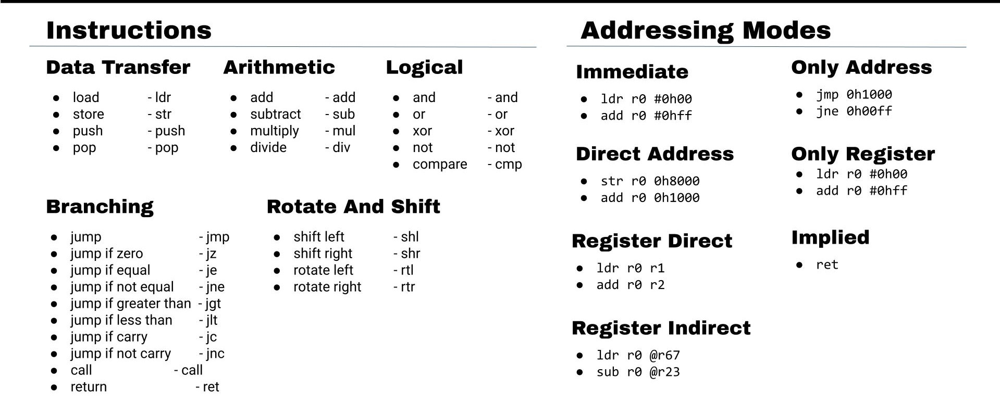
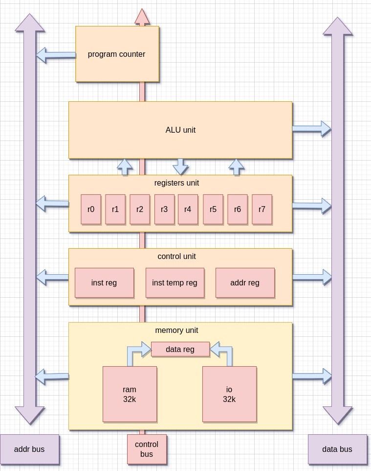
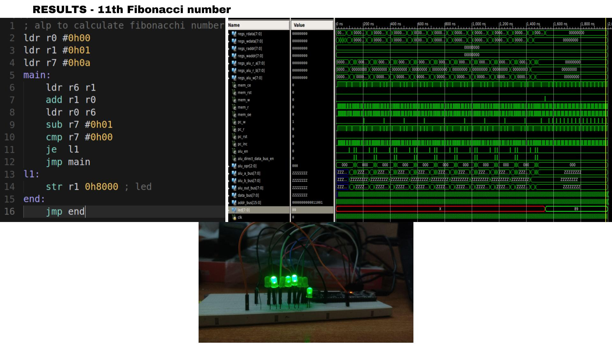

# SCPU

## Introduction

### SCPU is a simple 8-bit CPU which is inspired by RISC and CISC Architectures and designs

### Implementation of SCPU is done in verilog and tested on FPGA

- Here is the ppt for mid report of project [ppt](https://docs.google.com/presentation/d/112zQJcKLj0cgI-V4E3m5nO33tk7sK6VKgW8s_C7ouG4/edit?usp=sharing)

## Features

- 8-bit data bus
- 16-bit address bus (64kb RAM space)
- 8 8-bit general purpose registers (r0 to r7)
- separate buses for data and address
  - so pair of consecutive registers can used as pointers
- many instructions can directly work on data from memory unlike in RISC machines
- memory mapped IO
- tools such as assembler are provided

## Instructions

### opcodes can be found in google sheets [inst](https://docs.google.com/spreadsheets/d/1KVqwt1ClcE3EUQ0KAUEX9mtVtfocC9TOWTyaNruckrQ/edit?usp=sharing "inst")

## Architecture

## Examples

### finding nth fibonacci number

## Future Goals

- [x] implement stack and remaining ALU operations
- [ ] Emulator for testing without hardware
- [ ] More test cases
- [ ] adding more hardware features
  - [ ] UART boot loader
  - [ ] interrupts

## Contribution

### I am open for ideas, discussions and any kind of contribution

## About Me

### I started learning about how CPU works and how to use an FPGA to implement the hardware. lot more to learn and really excited about it

### You can contact me on [twitter](https://twitter.com/mohdfahad12328)
